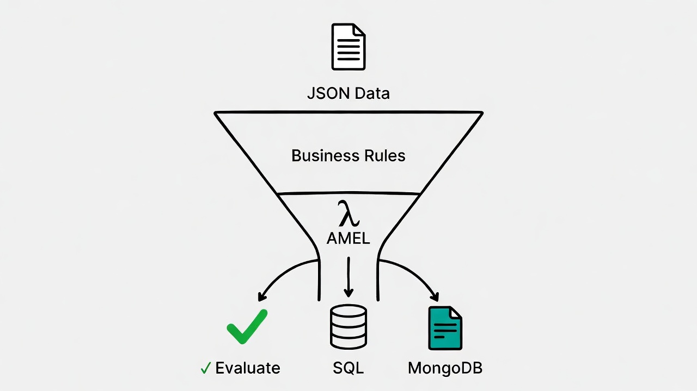

# AMEL - Adaptive Matching Expression Language

A general-purpose, typed, extensible Query & Rule DSL engine for evaluating arbitrary JSON payloads.

[](https://go.dev/)




## Overview

AMEL is a powerful Domain-Specific Language (DSL) engine designed to evaluate expressions against JSON data. It provides:

- **Type-safe expressions** with compile-time validation
- **JSONPath variable access** for nested data extraction
- **60+ built-in functions** for common operations
- **User-defined JavaScript functions** with sandboxed execution
- **SQL & MongoDB compilation** targets
- **Lambda expressions** and array operations
- **Regex pattern matching** support
- **Explainable evaluation** for debugging and auditing

## Quick Start

### Installation

```bash
go get github.com/bencagri/amel
```

### Basic Usage

```go
package main

import (
    "fmt"
    "github.com/bencagri/amel/pkg/engine"
)

func main() {
    // Create a new engine
    eng, _ := engine.New()

    // Define your payload
    payload := map[string]interface{}{
        "user": map[string]interface{}{
            "name": "John",
            "age":  25,
            "role": "admin",
        },
    }

    // Evaluate an expression
    result, _ := eng.EvaluateDirect(`$.user.age >= 18 && $.user.role == "admin"`, payload)
    fmt.Println(result.Raw) // Output: true
}
```

## Documentation

| Document | Description |
|----------|-------------|
| [Getting Started](./docs/01-getting-started.md) | Installation and basic concepts |
| [Expression Syntax](./docs/02-syntax.md) | Complete DSL grammar reference |
| [Built-in Functions](./docs/03-functions.md) | All 60+ built-in functions |
| [Custom Functions](./docs/04-custom-functions.md) | Writing JavaScript functions |
| [Array Operations](./docs/05-array-operations.md) | Map, filter, reduce, and more |
| [SQL Compilation](./docs/06-sql-compilation.md) | Compiling to SQL queries |
| [MongoDB Compilation](./docs/07-mongodb-compilation.md) | Compiling to MongoDB queries |
| [API Reference](./docs/08-api-reference.md) | Complete Go API documentation |

## Features at a Glance

### Expression Evaluation

```go
// Simple comparisons
eng.EvaluateDirect(`$.price > 100`, payload)

// Logical operators
eng.EvaluateDirect(`$.age >= 18 && $.verified == true`, payload)

// Membership testing
eng.EvaluateDirect(`$.role IN ["admin", "moderator"]`, payload)

// Regex matching
eng.EvaluateDirect(`$.email =~ "@company\\.com$"`, payload)

// Function calls
eng.EvaluateDirect(`upper($.name) == "JOHN"`, payload)
```

### Array Operations

```go
// Map
eng.EvaluateDirect(`map([1, 2, 3], x => x * 2)`, nil)  // [2, 4, 6]

// Filter
eng.EvaluateDirect(`filter([1, 2, 3, 4], x => x > 2)`, nil)  // [3, 4]

// Reduce
eng.EvaluateDirect(`reduce([1, 2, 3], 0, (acc, x) => acc + x)`, nil)  // 6
```

### SQL Compilation

```go
compiler := compiler.NewSQLCompiler(compiler.WithDialect(compiler.DialectPostgres))
result, _ := compiler.Compile(expr)
// SQL: ("age" > $1) AND ("status" = $2)
// Params: [18, "active"]
```

### MongoDB Compilation

```go
compiler := compiler.NewMongoDBCompiler()
result, _ := compiler.Compile(expr)
// Query: {"$and": [{"age": {"$gt": 18}}, {"status": "active"}]}
```

## Why AMEL?

| Feature | AMEL | JSON Logic | CEL | SpEL |
|---------|------|------------|-----|------|
| Type Safety | ✅ | ❌ | ✅ | ✅ |
| User Functions | ✅ (JS) | ❌ | Limited | ✅ (Java) |
| SQL Compilation | ✅ | ❌ | ❌ | ❌ |
| MongoDB Compilation | ✅ | ❌ | ❌ | ❌ |
| Regex Support | ✅ | ❌ | ✅ | ✅ |
| Array Operations | ✅ | Limited | ✅ | ✅ |
| Explanation Mode | ✅ | ❌ | ❌ | ❌ |
| Sandboxed Execution | ✅ | N/A | ✅ | ❌ |
| Language Agnostic | ✅ (Go) | ✅ | ✅ | ❌ (JVM only) |

## Performance

| Operation | Target | Max Acceptable |
|-----------|--------|----------------|
| Lexing (100 tokens) | < 10µs | < 50µs |
| Parsing (simple expr) | < 20µs | < 100µs |
| Evaluation (no functions) | < 50µs | < 200µs |
| Evaluation (with JS fn) | < 500µs | < 2ms |

## Contributing

We welcome contributions! Please see our [Contributing Guidelines](./CONTRIBUTING.md) for details.

## License

See [LICENSE](./LICENSE) for details.
